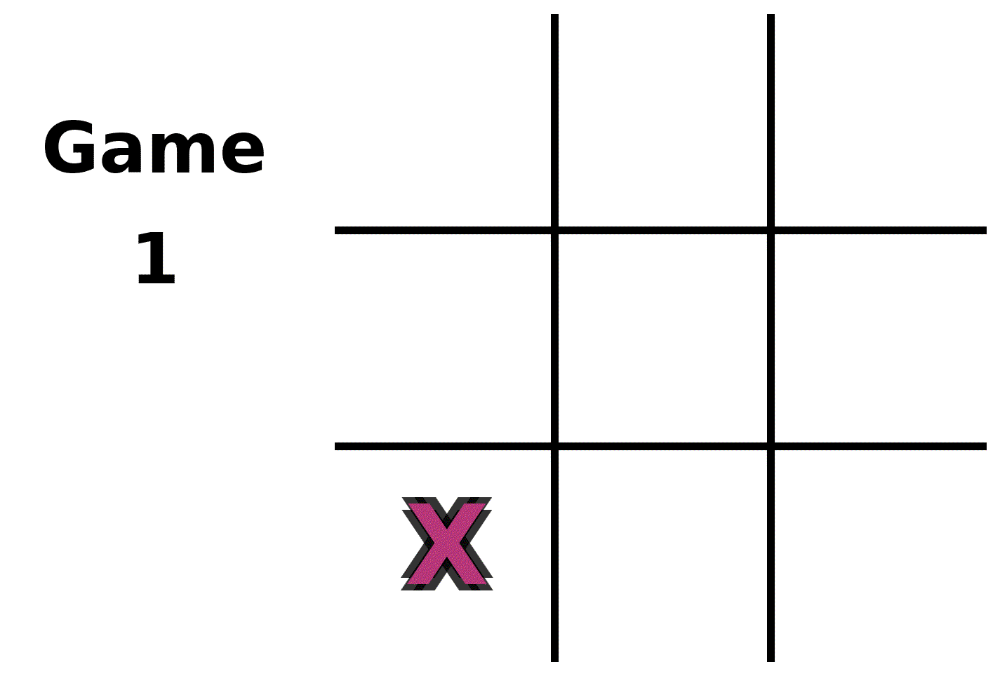
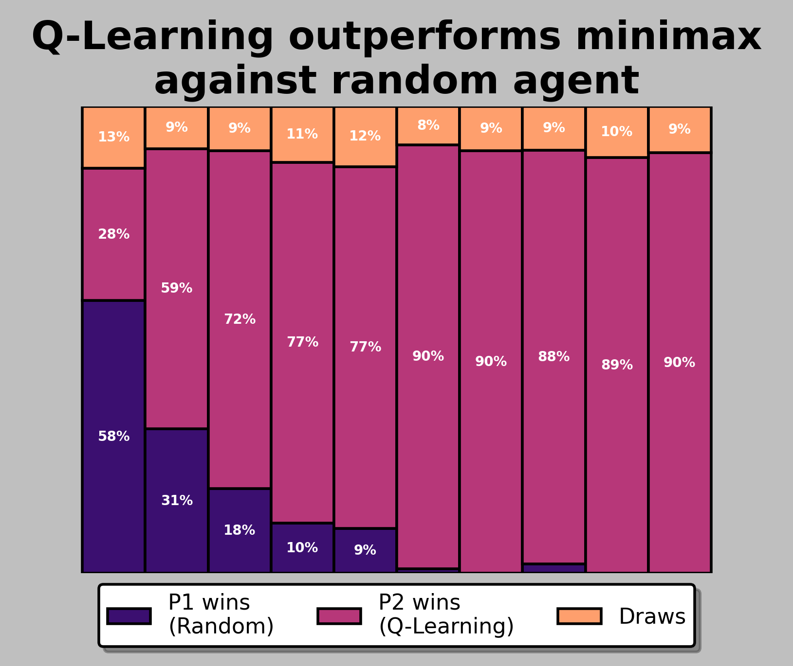
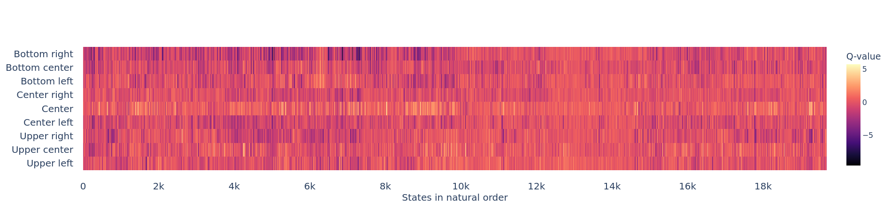
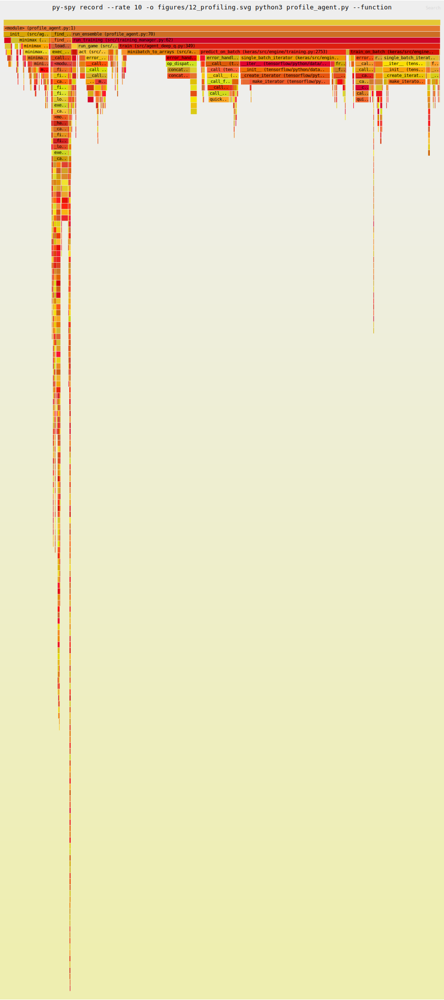
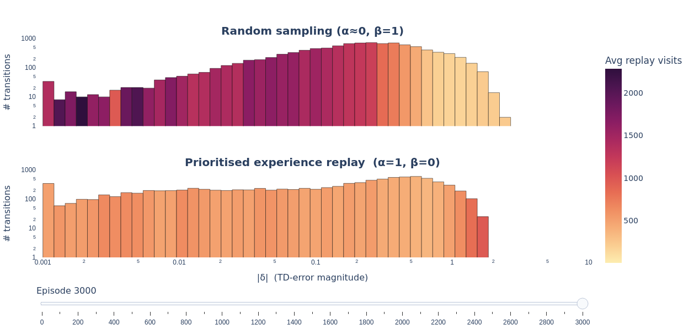
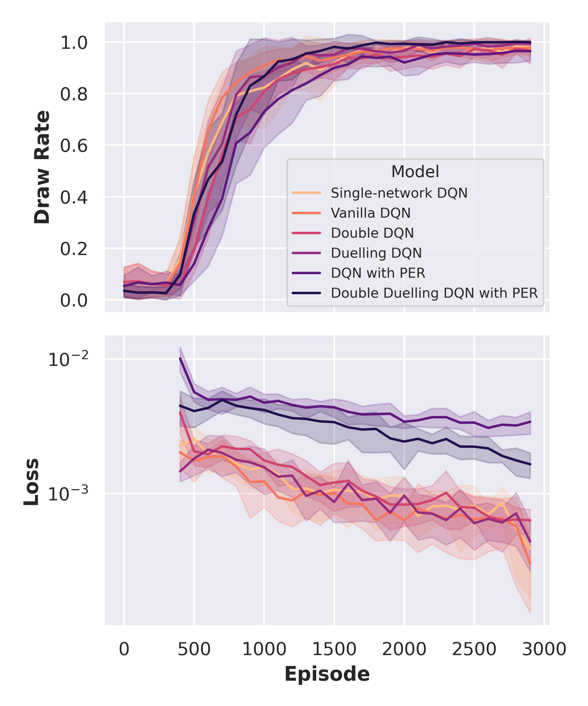

# Play Tic-Tac-Toe with Reinforcement Learning




## Content

Implement simple tictactoe game in Python with text-based output and learn how to play it using the Minmax algorithm, tabular Q-learning and deep Q-learning with dense and covolutional neural networks using a dual network architecture, dueling network and (prioritised) experience replay. The neural networks are implemented using Keras and TensorFlow. I took inspiration and validated the results with Casten Friedrich's tutorial on implementing reinforcement agents for tictactoe https://github.com/fcarsten/tic-tac-toe.

Please see my blog posts explaining the code in case of interest:
-  

-  

-  

-  


The figures were generated using the respective Jupyter notebooks.

The source code can be found in the ```src``` folder. The game is implemented in ```src/tictactoe.py```. The training infrastructure is implemented in the files ```src/training_manager.py``` and ```src/game_manager.py```. The different agents are derived from the ```Agent``` class defined in ```src/agent.py```. They implement the different reinforcement learning strategies.


## Figures


## Usage

Install requirements via

```
pip install -r requirements.txt
```

Find a comparison of different network architectures for three test cases (play second against agent moving randomly, play first against minmax agent, play second against non-deterministic minmax agent) in the Jupyter notebook

```
analysis.ipynb
```
